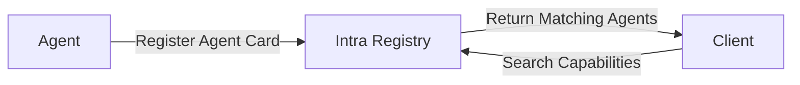

## Overview

The **Agent-to-Agent (A2A) Protocol** is an open standard developed by Google to enable seamless interoperability between AI agents across different platforms and frameworks. It solves the fundamental problem of agent discovery and communication in heterogeneous environments.

<Info>
  **Official Resources:**
  - [A2A Protocol Specification](https://google.github.io/A2A/)
  - [A2A Website](https://a2a.how/)
  - [A2A Topics](https://google.github.io/A2A/topics/)
</Info>

## Key Features

### 1. Agent Cards

Machine-readable documents that describe agent capabilities:

- **Endpoints**: Where to reach the agent
- **Supported Tasks**: What the agent can do
- **Authentication Requirements**: How to authenticate
- **Schemas**: Input/output data structures
- **Versioning**: Support for multiple versions
- **Deprecation**: Managed sunset of old versions

**Example Agent Card:**

```json
{
  "agentCard": {
    "name": "data-analyzer",
    "description": "Analyzes data and generates insights",
    "version": "1.0.0",
    "provider": {
      "name": "Acme Corp",
      "url": "https://acme.com"
    },
    "capabilities": {
      "skills": [
        {
          "name": "analyze_csv",
          "description": "Analyzes CSV data",
          "inputSchema": {
            "type": "object",
            "properties": {
              "data": { "type": "string", "format": "csv" }
            }
          },
          "outputSchema": {
            "type": "object",
            "properties": {
              "summary": { "type": "object" },
              "insights": { "type": "array" }
            }
          }
        }
      ]
    }
  }
}
```

### 2. Task-Based Workflows

Clear lifecycle management for agent interactions:

<Steps>
  <Step title="Pending">
    Task created and queued for processing
  </Step>
  <Step title="In Progress">
    Agent actively working on the task
  </Step>
  <Step title="Completed">
    Task finished successfully with results
  </Step>
  <Step title="Failed">
    Task encountered an error with details
  </Step>
</Steps>

**Features:**
- Multi-turn interactions for complex workflows
- Streaming support for real-time updates
- Rich content types: text, files, structured data
- Unique task IDs for tracking and observability

**Example Task:**

```json
{
  "taskId": "task_abc123",
  "agentId": "data-analyzer",
  "status": "in-progress",
  "input": {
    "skill": "analyze_csv",
    "parameters": {
      "data": "name,age,city\nAlice,30,NYC\nBob,25,SF"
    }
  },
  "progress": 0.45,
  "estimatedCompletion": "2025-09-30T14:30:00Z"
}
```

### 3. Enterprise-Ready Design

Built for production from day one:

<CardGroup cols={2}>
  <Card title="Authentication" icon="lock">
    - OAuth 2.0
    - API Keys
    - Bearer Tokens
    - Custom Schemes
    - Mutual TLS (mTLS)
  </Card>
  
  <Card title="Streaming" icon="stream">
    - Server-Sent Events (SSE)
    - WebSocket Support
    - Real-time Updates
    - Progress Notifications
  </Card>
  
  <Card title="Notifications" icon="bell">
    - Push Notifications
    - Webhook Integration
    - Async Workflows
    - Event-driven Updates
  </Card>
  
  <Card title="Audit Trails" icon="clipboard-list">
    - Full Request Logging
    - Compliance Ready
    - Trace IDs
    - Retention Policies
  </Card>
</CardGroup>

### 4. Framework Agnostic

Works with any agent framework or platform:

<Tabs>
  <Tab title="LangChain">
    ```python
    from langchain.agents import Agent
    from intra import A2AAdapter
    
    # Wrap your LangChain agent
    agent = Agent(...)
    a2a_agent = A2AAdapter(agent)
    a2a_agent.register()
    ```
  </Tab>
  
  <Tab title="AutoGen">
    ```python
    from autogen import AssistantAgent
    from intra import A2AAdapter
    
    # Wrap your AutoGen agent
    agent = AssistantAgent(...)
    a2a_agent = A2AAdapter(agent)
    a2a_agent.register()
    ```
  </Tab>
  
  <Tab title="Custom">
    ```python
    from intra import Agent
    
    # Create a custom agent
    @agent.skill(name="custom_skill")
    async def custom_handler(input):
        # Your logic here
        return {"result": "success"}
    ```
  </Tab>
</Tabs>

## How A2A Works

### 1. Discovery Phase

Agents register their capabilities in the central registry:



**Example:**
```python
from intra import Registry

registry = Registry()

# Register agent
registry.publish(agent_card)

# Discover agents
agents = registry.search(
    capabilities=["data-analysis"],
    modalities=["text", "json"]
)
```

### 2. Negotiation Phase

Agents exchange capability information and parameters:

```python
# Get agent details
agent_info = registry.get_agent("data-analyzer")

# Check compatibility
if "analyze_csv" in agent_info.skills:
    # Agent supports the skill we need
    pass
```

### 3. Execution Phase

Tasks are created and progress through lifecycle states:

```python
from intra import TaskClient

client = TaskClient()

# Create task
task = client.create_task(
    agent_id="data-analyzer",
    skill="analyze_csv",
    input={"data": csv_content}
)

# Monitor progress
for update in client.stream_task(task.id):
    print(f"Progress: {update.progress}%")

# Get result
result = client.get_task(task.id)
```

### 4. Observability

Every interaction is traced and logged:

```python
from intra import Observability

obs = Observability()

# Get traces
traces = obs.get_traces(
    task_id="task_abc123",
    include_spans=True
)

# Get metrics
metrics = obs.get_metrics(
    agent_id="data-analyzer",
    time_range="24h"
)
```

## Real-World Applications

### Multi-Agent Research & Development

Coordinate research agents, code generation agents, and testing agents to automate software development workflows.

```python
from intra import Workflow, Registry

# Discover agents
registry = Registry()
researcher = registry.find("research-agent")
analyzer = registry.find("code-analyzer")
generator = registry.find("code-generator")
tester = registry.find("test-agent")

# Create workflow
workflow = Workflow(name="automated-development")

# Research phase
research_task = workflow.add_task(
    agent=researcher,
    skill="gather_requirements",
    input={"topic": "payment processing API"}
)

# Analysis phase
analysis_task = workflow.add_task(
    agent=analyzer,
    skill="analyze_requirements",
    input={"requirements": research_task.output},
    depends_on=[research_task]
)

# Generation phase
code_task = workflow.add_task(
    agent=generator,
    skill="generate_code",
    input={"spec": analysis_task.output},
    depends_on=[analysis_task]
)

# Testing phase
test_task = workflow.add_task(
    agent=tester,
    skill="run_tests",
    input={"code": code_task.output},
    depends_on=[code_task]
)

# Execute
result = workflow.execute()
```

### Enterprise Automation

Deploy domain-specific agents for customer support, data analysis, and business intelligence.

```python
from intra import Agent, Registry

# Support agent with multiple skills
support_agent = Agent(
    name="customer-support",
    capabilities=["support", "nlp"]
)

@support_agent.skill(name="handle_query")
async def handle_query(query: str, context: dict):
    # Classify query
    category = classify(query)
    
    if category == "billing":
        # Route to billing specialist agent
        billing_agent = registry.find("billing-specialist")
        return await billing_agent.execute(query)
    
    elif category == "technical":
        # Route to technical support
        tech_agent = registry.find("tech-support")
        return await tech_agent.execute(query)
    
    else:
        # Handle general queries
        return generate_response(query, context)

support_agent.register()
```

### E-commerce & Transactions

Use AP2 to enable agents to handle purchases and payments with user consent.

```python
from intra import Agent, PaymentClient

shopping_agent = Agent(name="shopping-assistant")
payment = PaymentClient()

@shopping_agent.skill(name="purchase_product")
async def purchase_product(
    product_id: str,
    quantity: int,
    user_id: str
):
    # Get product details
    product = await get_product(product_id)
    total = product.price * quantity
    
    # Create payment intent
    intent = payment.create_intent(
        amount=total,
        currency="USD",
        description=f"{quantity}x {product.name}"
    )
    
    # Request user consent
    consent = await payment.request_consent(
        intent_id=intent.id,
        user_id=user_id
    )
    
    if consent.approved:
        # Process payment
        result = await payment.process(intent.id)
        
        # Fulfill order
        order = await create_order(
            user_id=user_id,
            product_id=product_id,
            quantity=quantity,
            transaction_id=result.transaction_id
        )
        
        return {
            "status": "success",
            "order_id": order.id,
            "receipt_url": result.receipt_url
        }
```

### Content Generation Pipeline

Automate content creation with specialized agents:

```python
# Content pipeline
content_workflow = Workflow(name="content-generation")

# Research
research = content_workflow.add_task(
    agent="research-agent",
    skill="gather_information",
    input={
        "topic": "AI trends 2025",
        "sources": ["arxiv", "tech_blogs", "news"]
    }
)

# Outline
outline = content_workflow.add_task(
    agent="content-planner",
    skill="create_outline",
    input={"research": research.output},
    depends_on=[research]
)

# Writing
draft = content_workflow.add_task(
    agent="content-writer",
    skill="write_article",
    input={
        "outline": outline.output,
        "tone": "professional",
        "length": 2000
    },
    depends_on=[outline]
)

# Final editing
final = content_workflow.add_task(
    agent="editor-agent",
    skill="edit_and_polish",
    input={"draft": draft.output},
    depends_on=[draft]
)

result = content_workflow.execute()
```

### Data Processing & Analysis

Orchestrate ETL pipelines with specialized processing agents:

```python
# ETL Pipeline
data_pipeline = Workflow(name="etl-pipeline")

# Extract
extract = data_pipeline.add_task(
    agent="data-extractor",
    skill="extract",
    input={
        "sources": [
            {"type": "api", "url": "https://api.example.com/data"},
            {"type": "database", "connection": "postgresql://..."},
            {"type": "file", "path": "s3://bucket/data.csv"}
        ]
    }
)

# Transform
transform = data_pipeline.add_task(
    agent="data-transformer",
    skill="transform",
    input={
        "data": extract.output,
        "transformations": ["clean_nulls", "normalize_dates", "deduplicate"]
    },
    depends_on=[extract]
)

# Analyze
analyze = data_pipeline.add_task(
    agent="data-analyzer",
    skill="analyze",
    input={"data": transform.output},
    depends_on=[transform]
)

# Load
load = data_pipeline.add_task(
    agent="data-loader",
    skill="load",
    input={
        "data": transform.output,
        "destination": "warehouse",
        "table": "processed_data"
    },
    depends_on=[transform, analyze]
)

result = data_pipeline.execute()
```

## Benefits of A2A

<CardGroup cols={2}>
  <Card title="Interoperability" icon="puzzle-piece">
    Agents from different frameworks can work together seamlessly
  </Card>
  
  <Card title="Discoverability" icon="magnifying-glass">
    Find agents by capability, not just by name
  </Card>
  
  <Card title="Standardization" icon="check-double">
    Common protocol reduces integration complexity
  </Card>
  
  <Card title="Scalability" icon="chart-line">
    Build complex multi-agent systems with confidence
  </Card>
  
  <Card title="Enterprise Ready" icon="building">
    Security, observability, and compliance built-in
  </Card>
  
  <Card title="Cost Effective" icon="dollar-sign">
    Pay only for what you use with flexible pricing
  </Card>
</CardGroup>

## Getting Started with Intra

Intra makes it easy to build on the A2A protocol with our comprehensive platform:

### Free Tier
Start building immediately with:
- 10k tokens per day
- Access to 25+ LLMs
- Up to 3 agents
- 100 API requests/day

### Production Plans
Scale to production with our Plus ($20/month) and Max ($200/month) plans, or use Pay As You Go for maximum flexibility.

<Card title="View Full Pricing" icon="tag" href="https://tryintra.app/pricing">
  Explore all plans and features
</Card>

## Platform Roadmap

### ✅ Phase 1: Foundation (Complete)
- Agent registration wizard
- Domain verification
- Basic registry search
- A2A protocol implementation

### 🚧 Phase 2: Registry & Discovery (In Progress)
- Enhanced search with faceted filters
- Preflight testing system
- JSON editor for Agent Cards
- Backend API implementation

### 📋 Phase 3-6: Coming Soon
- Task orchestration and streaming
- Advanced observability with OpenTelemetry
- AP2 payment integration
- Enhanced developer tools (SDKs, CLI)

<Card title="View Full Roadmap" icon="map" href="https://tryintra.app/roadmap">
  See our complete product roadmap
</Card>

## Next Steps

<CardGroup cols={2}>
  <Card
    title="AP2 Protocol"
    icon="credit-card"
    href="/core-technology/ap2-protocol"
  >
    Learn about agent payments
  </Card>
  <Card
    title="Platform Features"
    icon="grid"
    href="/platform/features"
  >
    Explore Intra's capabilities
  </Card>
  <Card
    title="Quick Start"
    icon="rocket"
    href="/quickstart"
  >
    Register your first agent
  </Card>
  <Card
    title="API Reference"
    icon="code"
    href="/api-reference/introduction"
  >
    Detailed API docs
  </Card>
</CardGroup>