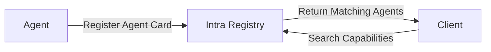

## Overview

The **Agent-to-Agent (A2A) Protocol** is an open standard developed by Google to enable seamless interoperability between AI agents across different platforms and frameworks. It solves the fundamental problem of agent discovery and communication in heterogeneous environments.

<Info>
  **Official Resources:**
  - [A2A Protocol Specification](https://google.github.io/A2A/)
  - [A2A Website](https://a2a.how/)
  - [A2A Topics](https://google.github.io/A2A/topics/)
</Info>

## Key Features

### 1. Agent Cards

Machine-readable documents that describe agent capabilities:

- **Endpoints**: Where to reach the agent
- **Supported Tasks**: What the agent can do
- **Authentication Requirements**: How to authenticate
- **Schemas**: Input/output data structures
- **Versioning**: Support for multiple versions
- **Deprecation**: Managed sunset of old versions

**Example Agent Card:**

```json
{
  "agentCard": {
    "name": "data-analyzer",
    "description": "Analyzes data and generates insights",
    "version": "1.0.0",
    "provider": {
      "name": "Acme Corp",
      "url": "https://acme.com"
    },
    "capabilities": {
      "skills": [
        {
          "name": "analyze_csv",
          "description": "Analyzes CSV data",
          "inputSchema": {
            "type": "object",
            "properties": {
              "data": { "type": "string", "format": "csv" }
            }
          },
          "outputSchema": {
            "type": "object",
            "properties": {
              "summary": { "type": "object" },
              "insights": { "type": "array" }
            }
          }
        }
      ]
    }
  }
}
```

### 2. Task-Based Workflows

Clear lifecycle management for agent interactions:

<Steps>
  <Step title="Pending">
    Task created and queued for processing
  </Step>
  <Step title="In Progress">
    Agent actively working on the task
  </Step>
  <Step title="Completed">
    Task finished successfully with results
  </Step>
  <Step title="Failed">
    Task encountered an error with details
  </Step>
</Steps>

**Features:**
- Multi-turn interactions for complex workflows
- Streaming support for real-time updates
- Rich content types: text, files, structured data
- Unique task IDs for tracking and observability

**Example Task:**

```json
{
  "taskId": "task_abc123",
  "agentId": "data-analyzer",
  "status": "in-progress",
  "input": {
    "skill": "analyze_csv",
    "parameters": {
      "data": "name,age,city\nAlice,30,NYC\nBob,25,SF"
    }
  },
  "progress": 0.45,
  "estimatedCompletion": "2025-09-30T14:30:00Z"
}
```

### 3. Enterprise-Ready Design

Built for production from day one:

<CardGroup cols={2}>
  <Card title="Authentication" icon="lock">
    - OAuth 2.0
    - API Keys
    - Bearer Tokens
    - Custom Schemes
    - Mutual TLS (mTLS)
  </Card>
  
  <Card title="Streaming" icon="stream">
    - Server-Sent Events (SSE)
    - WebSocket Support
    - Real-time Updates
    - Progress Notifications
  </Card>
  
  <Card title="Notifications" icon="bell">
    - Push Notifications
    - Webhook Integration
    - Async Workflows
    - Event-driven Updates
  </Card>
  
  <Card title="Audit Trails" icon="clipboard-list">
    - Full Request Logging
    - Compliance Ready
    - Trace IDs
    - Retention Policies
  </Card>
</CardGroup>

### 4. Framework Agnostic

Works with any agent framework or platform:

<Tabs>
  <Tab title="LangChain">
    ```python
    from langchain.agents import Agent
    from intra import A2AAdapter
    
    # Wrap your LangChain agent
    agent = Agent(...)
    a2a_agent = A2AAdapter(agent)
    a2a_agent.register()
    ```
  </Tab>
  
  <Tab title="AutoGen">
    ```python
    from autogen import AssistantAgent
    from intra import A2AAdapter
    
    # Wrap your AutoGen agent
    agent = AssistantAgent(...)
    a2a_agent = A2AAdapter(agent)
    a2a_agent.register()
    ```
  </Tab>
  
  <Tab title="Custom">
    ```python
    from intra import Agent
    
    # Create a custom agent
    @agent.skill(name="custom_skill")
    async def custom_handler(input):
        # Your logic here
        return {"result": "success"}
    ```
  </Tab>
</Tabs>

## How A2A Works

### 1. Discovery Phase

Agents register their capabilities in the central registry:



**Example:**
```python
from intra import Registry

registry = Registry()

# Register agent
registry.publish(agent_card)

# Discover agents
agents = registry.search(
    capabilities=["data-analysis"],
    modalities=["text", "json"]
)
```

### 2. Negotiation Phase

Agents exchange capability information and parameters:

```python
# Get agent details
agent_info = registry.get_agent("data-analyzer")

# Check compatibility
if "analyze_csv" in agent_info.skills:
    # Agent supports the skill we need
    pass
```

### 3. Execution Phase

Tasks are created and progress through lifecycle states:

```python
from intra import TaskClient

client = TaskClient()

# Create task
task = client.create_task(
    agent_id="data-analyzer",
    skill="analyze_csv",
    input={"data": csv_content}
)

# Monitor progress
for update in client.stream_task(task.id):
    print(f"Progress: {update.progress}%")

# Get result
result = client.get_task(task.id)
```

### 4. Observability

Every interaction is traced and logged:

```python
from intra import Observability

obs = Observability()

# Get traces
traces = obs.get_traces(
    task_id="task_abc123",
    include_spans=True
)

# Get metrics
metrics = obs.get_metrics(
    agent_id="data-analyzer",
    time_range="24h"
)
```

## Protocol Specifications

### Agent Card Schema

<AccordionGroup>
  <Accordion title="Required Fields" icon="asterisk">
    - `name`: Unique agent identifier
    - `version`: Semantic version (e.g., 1.0.0)
    - `provider`: Organization information
    - `capabilities`: Skills and modalities
    - `interfaces`: Communication endpoints
  </Accordion>
  
  <Accordion title="Optional Fields" icon="circle">
    - `description`: Human-readable description
    - `icon`: Agent icon URL
    - `tags`: Searchable tags
    - `pricing`: Cost information
    - `rateLimit`: Usage limits
  </Accordion>
  
  <Accordion title="Security Fields" icon="shield">
    - `authentication`: Auth requirements
    - `authorization`: Permission scopes
    - `signature`: Cryptographic signature
    - `publicKey`: Verification key
  </Accordion>
</AccordionGroup>

### Task Schema

```typescript
interface Task {
  taskId: string;
  agentId: string;
  status: 'pending' | 'in-progress' | 'completed' | 'failed';
  input: {
    skill: string;
    parameters: Record<string, any>;
  };
  output?: Record<string, any>;
  error?: {
    code: string;
    message: string;
    details?: Record<string, any>;
  };
  metadata: {
    createdAt: string;
    updatedAt: string;
    estimatedCompletion?: string;
    cost?: number;
  };
}
```

## Benefits of A2A

<CardGroup cols={2}>
  <Card title="Interoperability" icon="puzzle-piece">
    Agents from different frameworks can work together seamlessly
  </Card>
  
  <Card title="Discoverability" icon="magnifying-glass">
    Find agents by capability, not just by name
  </Card>
  
  <Card title="Standardization" icon="check-double">
    Common protocol reduces integration complexity
  </Card>
  
  <Card title="Scalability" icon="chart-line">
    Build complex multi-agent systems with confidence
  </Card>
</CardGroup>

## Real-World Applications

### Multi-Agent Research Workflow

```python
# Discover agents for research workflow
researcher = registry.find("research-agent")
analyzer = registry.find("data-analysis")
writer = registry.find("content-generator")

# Orchestrate workflow
research_data = researcher.execute(topic="AI trends")
analysis = analyzer.execute(data=research_data)
report = writer.execute(insights=analysis)
```

### Customer Support Automation

```python
# Route customer queries to specialized agents
support_agents = registry.search(
    capabilities=["customer-support"],
    tags=["billing", "technical", "general"]
)

# Intelligent routing based on query
agent = route_to_best_agent(query, support_agents)
response = agent.handle(query)
```

## Next Steps

<CardGroup cols={2}>
  <Card
    title="AP2 Protocol"
    icon="credit-card"
    href="/core-technology/ap2-protocol"
  >
    Learn about agent payments
  </Card>
  <Card
    title="Platform Features"
    icon="grid"
    href="/platform/features"
  >
    Explore Intra's capabilities
  </Card>
  <Card
    title="Quick Start"
    icon="rocket"
    href="/quickstart"
  >
    Register your first agent
  </Card>
  <Card
    title="API Reference"
    icon="code"
    href="/api-reference/introduction"
  >
    Detailed API docs
  </Card>
</CardGroup>
